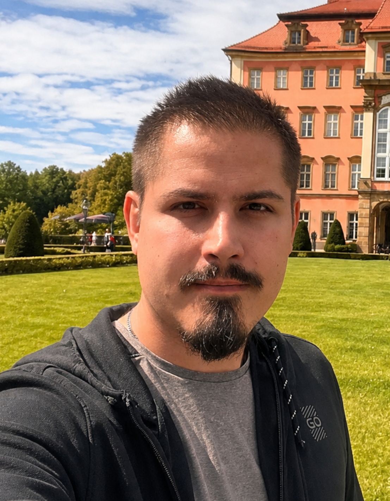

# Slides for my talks

Made using [Slidev](https://github.com/slidevjs/slidev)

## WHOAMI

Kamil Senecki is an IT professional with roots in embedded systems testing and a long-standing passion for agile ways of working. Since discovering Scrum early in his career, he has been practicing and promoting agile methodologies and frameworks. His experience spans team coaching, collaboration in agile environments, and translating agile principles into everyday practice. Outside of work, he enjoys learning new things, fantasy books, and board games.

## Contact

[Website](https://zwinnapanda.pl/)  
[Linkedin](https://www.linkedin.com/in/kamilsenecki/)  
[Youtube Channel](https://www.youtube.com/@zwinnapanda)  

## Previous talks

- [DevOpsDays Kraków 04.07.2026](https://www.linkedin.com/company/devopsdays-krak%C3%B3w) - [The Trust Protocol: Human APIs for High-Performing Teams](https://www.youtube.com/live/Pux14O1uqd0?si=tGrKOIAZvIN1SkCj&t=5100)  
- DepCon 14 - 30.10.2024 ([Deployed](https://deployed.pl/) internal conference) - [Cybersecurity basics](https://youtu.be/NEwdQklALCg)  
- DepCon 13 - 15.03.2024 ([Deployed](https://deployed.pl/) internal conference) - [SEO for Developers](https://youtu.be/qw4r2TyZI98?si=1jaET6O2B4Mj7Yz0)  
- DepCon 8 - 21.12.2022 - ([Deployed](https://deployed.pl/) internal conference) - [Scrum Master Sins](https://youtu.be/kkFTX2_Fyxo)  
- DepCon 7 - 22.07.2022 - ([Deployed](https://deployed.pl/) internal conference) - [Types of Scrum](https://youtu.be/m5uq859o62E)  
- DepCon 6 - 12.2020 - ([Deployed](https://deployed.pl/) internal conference) - [Kanban Basics](https://youtu.be/6IlNOa73vcM)  
- DepCon 5 - 3.06.2020 - ([Deployed](https://deployed.pl/) internal conference) - [Software Development Lifecycle](https://youtu.be/twNpn5Q5Hfo)  
- DepCon 4 - 6.12.2019 - ([Deployed](https://deployed.pl/) internal conference) - Scrum Basics  
